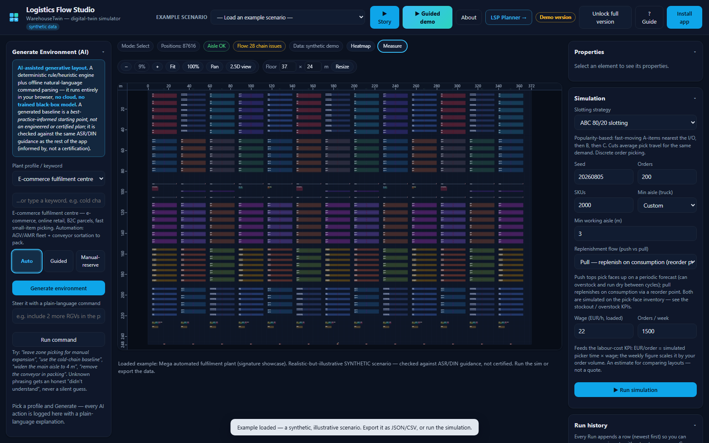
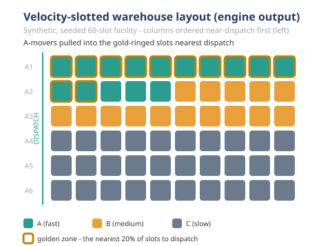
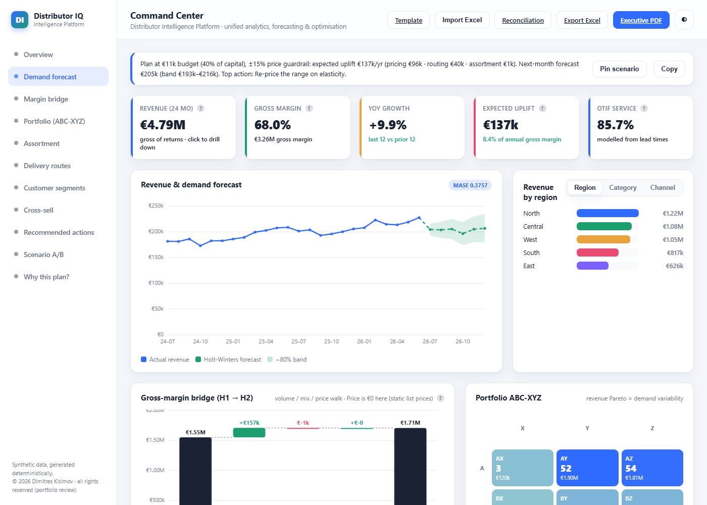

# Data & AI Case Study — mapped to two Würth internship roles

> **DISCLAIMER — read this first.** This is an **independent** case study I put together on my own. It is based **only on publicly available information** about the Würth Group (company website, public press, general industry knowledge). It is **not affiliated with, endorsed by, or reviewed by Würth**, and it uses **no internal, confidential, or proprietary Würth data or systems** of any kind. Every figure attributed to Würth's scale (number of companies, employees, revenue, ORSY installations, article counts) is **public and approximate** and is labelled as such — I have not invented internal Würth numbers. Every performance number in my own portfolio is measured on **synthetic / self-generated data** unless explicitly labelled otherwise, and I say so each time it appears (the real-data exceptions, `retail-analytics-real` and `decision-chain`, are measured on the public UCI Online Retail II dataset — CC BY 4.0 — and are labelled **real data** everywhere their numbers appear; `decision-chain` additionally labels its invented physical layers **synthetic-assigned** on every line). The point of this repo is to show *how I think and what I can build*, not to claim results on Würth's real business.

**In one sentence:** this repo maps two Würth Data & AI internship postings, requirement by requirement, to things I've already built and measured across a 23-repo portfolio — e.g. forecasting at **MASE 0.38** over 9 rolling folds *(synthetic data)*, **−48.6% pick travel** from a one-click warehouse layout optimizer *(synthetic data)*, and **£19,643,862** of real transactions analyzed in `retail-analytics-real` *(real data, labelled)*.

**Deutsche Zusammenfassung:** eine deutschsprachige Kurzfassung (Disclaimer zuerst, Kernidee, stärkste Belege, das Real-Daten-Projekt) steht in [`docs/ZUSAMMENFASSUNG_DE.md`](docs/ZUSAMMENFASSUNG_DE.md).

Hi — I'm Dimitres. I built this repository to answer one question honestly: *if I did a Data & AI internship at Würth, what could I actually contribute, and where's the evidence?*

I applied to two postings and this case study speaks to both:

- **Job #1 — Praktikum Data & AI: (Agentic) Automation mit Low-code Plattformen.** Building AI-agent workflows, low-code automation (n8n, Power Automate), connecting systems and APIs, rapid prototyping.
- **Job #2 — Praktikum Data & AI Analytics.** BI and Power BI, KPI dashboards, forecasting / predictive analytics, Python and SQL, data modelling, turning data into business decisions.

Rather than assert skills, I mapped each requirement to something I've already **built and measured** in my existing portfolio. The three documents in [`docs/`](docs/) are the substance; this README is the orientation.

---

## Featured work — one real story, four flagships

*The spine runs **prediction → operation → proof → buyer → revenue**. Four elevated flagships carry it: you can **operate** the warehouse, there is a real **engine** underneath, the whole chain **reconciles on one real dataset**, and it scales into a **command center** — each mapped to a concrete, public-information Würth opportunity (industrial **MRO** distribution, a catalogue in the **millions of SKUs**, **~2,600 branches / trade outlets** — public, approximate — multi-channel e-procurement / **ORSY**). Every figure below keeps its provenance label; all metrics are on **synthetic / self-generated data** unless a line says **real data**.*

### 1. Operate it — `logistics-flow-studio` (WarehouseTwin)

[](assets/hero-plant-2d.png)

An offline, browser-based **warehouse / WMS digital twin and plant-flow simulator** (installable PWA, zero network calls). Describe a plant in plain keywords and a transparent, deterministic generator builds a full valid layout — steerable with plain-language commands through an offline natural-language parser, *not a trained model* — then simulate the WMS operation (receiving → put-away → replenishment → picking → packing → shipping) with ISO 22400-grounded KPIs and the bottleneck named. New depth since the last cut: a one-click **Story Mode** cinematic tour that flies the camera zone-by-zone; an **894-element signature plant** exercising all 29 object types, overlap-free by construction (shown above); a **user-definable object library** (Siemens Plant-Simulation *UserObjects*-style — define your own object type with a glyph, size and colour and it joins both the palette *and* the simulation); and — v3.17–v3.19 — the twin is now a **factory / process-industry simulator** too: a multi-way proportional-flow **line sim** (declared split/merge ratios, flow conservation verified at every node), a generator-emitted QA-split archetype with **RPW balancing on resolved effective loads**, and a **fluids steady-state solver** (pipes/tanks/mixers in m³/h, the bottleneck named — "modelled, not measured", NOT CFD).
- **Würth opportunity.** Warehouse and branch intralogistics across ~2,600 branches (public, approximate): compare layout, slotting and picking strategy *before* touching a physical hall.
- **Proof *(synthetic)*.** One-click layout optimizer **−48.6% pick travel** on the demo layout (pinned + reproducible); **ABC 80/20 beats random slotting ~21%**; the generated QA-split line resolves to **112.5 parts/hr** at **≈ 88.1% line efficiency** (hand-computed, harness-pinned); a browser self-test **112/112** and **45 headless logic harnesses** all green; a canvas up to **400 × 250 m**, a 2.5D view and **23 example scenarios**. Standards panel (ISO 22400, DIN 15185, ASR, EN, VDI) framed "aligned to, **not** a certification".

### 2. The engine underneath — `logistics-digital-twin`

[](assets/warehouse_layout.svg)

The reference operations-research **engine behind the showpiece** — 3D carton packing (FFD with a CP-SAT optimality check), Hungarian-algorithm slotting, and a hand-rolled discrete-event simulation — sharing the exact same wt-1 layout format the app uses, so a floor drawn in the twin loads straight into the engine. The figure above is the engine's **own** hand-built SVG output (no plotting library, byte-identical across re-runs), the same velocity palette the live dashboard uses: the pretty picture is a faithful front-end to real OR.
- **Würth opportunity.** The tested analytics core that keeps the operable twin honest rather than a toy — the layer you would harden and re-measure first on real slotting / packing data.
- **Proof *(synthetic)*.** Slotting via linear assignment **−44.2% pick travel** (golden-zone A-occupancy **25% → 100%**, reshuffle break-even ~0.7 days); container fill **2.0% → 30.2%** (**56 containers saved**, CP-SAT proves the heuristic optimal on the checked instance); discrete-event sim modern-vs-legacy **cycle time −76.1%**, **picker travel −66.5%**; pick-path routing vs the exact Ratliff–Rosenthal optimum: **return +3.0%** above optimum, and the optimized layout routes **~46% shorter** than legacy at fixed policy.

### 3. It reconciles on one real dataset — `decision-chain`

One **real** dataset (UCI Online Retail II, 1,067,371 raw rows, *real data*, CC BY 4.0) run through the whole distributor decision chain — clean → forecast → replenish → slot → pick → route → a single reconciled ledger — with **13 cross-stage identities machine-checked to hold**, even under demand or cost shocks. This is the thing no single-silo demo can show: the functions actually agree with each other. (No screenshot embedded — the deliverable here is the numeric ledger below, not a UI.)
- **Würth opportunity.** At Würth's scale, forecasting, replenishment, warehousing, transport and controlling are separate systems and the losses concentrate *at the seams* — this proves the numbers still reconcile after every hand-off.
- **Proof *(real data + labelled synthetic-assigned layers)*.** All **13 / 13 identities PASS**, including cleaned revenue reproduced across two repositories **to the penny (GBP 19,643,861.62)** and the cost ledger's total to the cent — plus three additive cross-stage identities: **(n)** rebuilds the ledger total from the physical drivers to the cent; **(o)** proves a forecast error moves **only the holding line** (the elasticity of total cost equals the holding share **exactly — 0.0580** on the committed full run); and **(p)** spreads the ledger over all **4,151 real orders** and reassembles it **to the cent** — the costliest decile carries **59.0%** of delivered cost (Gini **0.665**), machine-verified, and under the invented rates a statement about the model's shape, not order profitability. Honest losses stay in the headline: on lumpy demand **nothing beats the one-week naive walk** (MASE 1.782); the exact slotting optimum is worth only **−1.6% over classic ABC**; OR-Tools CVRP beats 1964 Clarke-Wright by only **−0.2%**; every cost rate is **INVENTED and labelled** — no profit claims. Every identity has a deliberate-corruption FAIL path in the tests.

### 4. It scales into a command center — `distributor-intelligence-platform`

[](assets/command-center.png)

The Flask **MRO command center** that turns the engines into a decision cockpit — forecasting, assortment and routing behind one dashboard — with a **reconciliation guard** so no headline number can silently drift from the code that produced it: a `/reconcile` executive brief renders a green "**no silent drift**" verdict, tracing every headline number to the engine field it came from. This is what a Würth-style distributor would actually sit in front of.
- **Würth opportunity.** The operator's view over assortment, pricing, availability and logistics — descriptive KPIs, the forecast, and the actual optimisation of price / assortment / routing in one place.
- **Proof *(synthetic)*.** Forecast **MASE 0.38** over 9 rolling folds; **25.0% routing km saved** vs the nearest-neighbour baseline; an expected **EUR 136,972/yr** modelled uplift (**8.4%** of annual gross margin); a continuous-review **inventory policy** (ROP/EOQ at ABC-XYZ service targets) holding **EUR 127,421** working capital — cycle + safety **exactly**, asserted by tests — at **5.5x turns** and a **99.9%** demand-weighted fill rate; the reconciliation guard holds **16/16 cross-engine identities** with all **21** headline numbers present — tested, Docker, CI.

---

## Who Würth is (public profile)

The Würth Group is a large, family-owned German-headquartered group in **assembly and fastening materials** and industrial **MRO** (maintenance, repair, operations) distribution. From public sources, at a high level and approximately:

- **~400+ operating companies** across **80+ countries** (public, approximate).
- On the order of **~87,000 employees** and **~€20B+ annual group revenue** (public, approximate — figures vary by year and reporting).
- A catalogue in the **millions of articles** — screws, fasteners, tools, chemicals, consumables (public, approximate).
- A deliberately **multi-channel** go-to-market: a large **field sales** force, physical **branches / trade outlets**, **e-commerce** shops, and **e-procurement / EDI** integrations into customer systems.
- The **ORSY** family of inventory and shelf-management systems (bins, racks, scanners, vending/automated replenishment) installed across many customer sites (public; exact counts approximate).

None of that is my data — it's the public picture of a distribution business that runs on **assortment, pricing, availability, logistics, and a very high volume of transactional documents and orders**. That combination is almost a textbook case for applied Data & AI.

## Why Data & AI matters in a business like this

A distributor at this scale lives or dies on a handful of quantitative levers, each of which is a place where analytics and automation pay for themselves:

- **Assortment** — which of millions of articles to stock, where. Wrong long-tail decisions tie up cash or lose sales.
- **Pricing & margin** — elasticity-aware pricing and discount discipline; small leakage on a huge order count is large money.
- **Inventory / replenishment** — service level vs. holding cost, ORSY-style auto-replenishment, demand forecasting.
- **Sales KPIs** — turning transaction data into decisions field and branch managers can act on.
- **Logistics** — routing and delivery efficiency across branches and customers.
- **Process automation** — the sheer volume of **RFQs, quotes, orders, invoices** flowing through email/EDI is where **agentic + low-code automation** removes manual toil.

## How this repo demonstrates fit for **both** postings

The portfolio behind this case study is now **23 repositories** (at [github.com/Dimitres-Kisimov](https://github.com/Dimitres-Kisimov)). I've built three complementary bodies of work — plus an integration capstone that ties them together — which is exactly why I can speak to both roles:

**Integration capstone (new, and the strongest single piece of evidence)**:
- `decision-chain` — **one real dataset through the whole distributor decision chain, with numbers that reconcile.** The UCI Online Retail II transactions (1,067,371 raw rows, *real data*) flow through clean → forecast → replenish → slot → pick → route → cost, and a reconciliation ledger machine-checks **13 cross-stage identities — all PASS**, including the cleaned revenue reproduced across two of my repositories **to the penny (£19,643,861.62)** and the cost ledger's total to the cent. The honest findings are part of the product: on lumpy demand nothing beats the naive walk (MASE 1.782); the exact slotting optimum is worth only **1.6% over classic ABC** (with the math explained); the CVRP metaheuristic beats the 1964 Clarke-Wright baseline by only **0.2%** and loses 19 of 48 days; the synthetic picking crew is **18% utilized** — reported, not hidden; every invented cost rate is labelled INVENTED. Three additive cross-stage identities extend the suite: **(n)** rebuilds the ledger total from the physical drivers (to the cent); **(o) — forecast-error containment** — proves a forecast surge moves only the holding line, so the elasticity of total cost equals the holding share **exactly (0.0580 on the committed full run)**; and **(p) — per-order cost-to-serve** — spreads the ledger over the window's **4,151 real orders** by labelled allocation rules and reassembles it: every column back to its ledger line **to the cent**, both planes to the ledger total **to the cent (253,427.16 == 253,427.16)**, per-order real revenue to the window revenue **to the penny** — with the concentration measured (costliest decile **59.0%** of delivered cost, Gini **0.665**) and honestly read as the model's shape under invented rates, never order profitability. Ships an offline dashboard with the 13-identity reconciliation panel, byte-reproducible PDF/Excel deliverables from a committed run artifact, and a deliberate-corruption FAIL path for every identity in the tests *(real data + labelled synthetic-assigned layers)*.

**Analytics side (Job #2)** — forecasting, KPIs, optimization, BI:
- `revops-optimizer` — assortment (MILP), newsvendor inventory, elasticity pricing, a **Power BI / DAX** pack and an exec deck; ~**€160k/yr** modelled uplift, now carrying its own uncertainty: a joint **Monte-Carlo band (P10–P90 EUR 145,091–170,723/yr)** with the honest read that the median lands *below* the point estimate and there is only a **~43% chance of clearing it**, a one-way **tornado** ranking which assumption moves the number most, and a disconnected **Power BI risk table** (`kpi_uplift_risk`) with matching DAX measures *(synthetic data; illustrative planning ranges, not a forecast)*.
- `sales-kpi-analytics` — KPI metrics, **forecasting with rolling-origin CV and MASE**, SQL, a **€2.6M** discount-leakage lever; new **pacing & target attainment**: run-rate **€10.91M = 95.7%** of the assumed €11.40M plan with an **empirical 80% prediction interval** — and the closed-year back-check reported honestly: the realised **€11.28M (98.9%)** landed just *above* the band, "because a prediction interval that always contains the answer is lying" *(synthetic data)*.
- `distributor-intelligence-platform` — the engines composed into one platform; **MASE 0.38** forecasting (9 rolling folds), **25% km** routing saving, MILP vs. greedy assortment, a continuous-review **inventory policy** (ROP/EOQ at ABC-XYZ service targets: **EUR 127,421** working capital, cycle + safety exactly, **5.5x turns**, **99.9%** fill), **€136,972/yr** modelled uplift, Docker, CI *(synthetic data)*.
- `route-optimizer` — OR-Tools CP-SAT vehicle routing vs. heuristics, **4.6% / 31%** savings; new **demand-uncertainty robustness** stress test: zero-buffer plans fail in ~96% of 200 seeded scenarios, and **5% capacity headroom cuts failing scenarios 96% → 44%** and the expected day by **4.6%** — the flaw of averages, measured; 36 tests *(synthetic data)*.
- `market-basket-analysis` — Apriori + FP-growth implemented from scratch and cross-checked for **exact equality**; **224 frequent itemsets, 254 rules, top lift 2.41**, 3 customer segments, cross-sell recommendations with labelled estimates; new **category affinity network** — 3 communities via greedy modularity (**Q = 0.58**) with **4 bridge edges** between communities as cross-merchandising candidates (honestly noted: the communities rediscover the generator's archetypes — machinery validation, not discovery); 55 tests *(synthetic data)*.
- `ml-models-lab` — small models, measured properly: a global forecaster at **MASE 0.987 / RMSSE 0.948** that beats both seasonal-naive (1.080/1.062) *and* Holt-Winters (1.101/1.019); a SKU text classifier at **macro-F1 0.963**; an anomaly autoencoder at **PR-AUC 0.963 vs PCA 0.951** — a narrow win I report honestly, recommending PCA as the default; churn at **PR-AUC 0.653** with Platt calibration taking ECE from 0.197 to **0.021**; elasticity endogeneity bias corrected from **+1.52 to +0.03** (profit regret 0.89%); new **bootstrap 95% skill-score CIs** — churn skill **+0.457 [+0.381, +0.528]** and elasticity-RMSE skill +0.918 [+0.904, +0.934], both entirely above zero (the torch models are excluded on purpose: their metrics are not bit-reproducible across builds, and the doc says so) *(synthetic data)*.
- `energy-demand-forecast` — day-ahead load forecasting + peak-shaving battery dispatch, from scratch on numpy/scipy: a temperature + calendar regression at **MASE 0.497 / MAPE 4.8%** winning **14/14 rolling-origin CV folds** vs seasonal-naive (1.369 / 17.6%) — with **Holt-Winters losing to the naive baseline (3.040 / 37.6%) reported, not hidden**; the peak-shaving **LP** cuts the mean monthly peak **368.2 → 291.1 kW (−20.9%)**, worth **~EUR 11,100/yr at an ASSUMED EUR 12/kW-month tariff** while a fixed-timer baseline saves **EUR 0** — and the business case states plainly that at an assumed EUR 120k–180k battery cost this is a **10+ year simple payback: the battery does not pay for itself on these assumptions**; new causal **day-ahead dispatch backtest** (weekly-refit forecast, month-anchored plan, meter-clamped execution): the deployable controller captures **EUR 8,066/yr — 72.7% of the perfect-foresight LP bound** — and the **robust variant is a measured negative result that stays in the table** (65.4% capture, 42% more battery cycling; neither band setting beats the plain point-forecast plan); 59 tests *(synthetic data)*.
- `quality-anomaly-vision` — surface-defect screening with three detectors trained on clean images only (local statistics, PCA reconstruction, small conv autoencoder), one scoring rule fixed in advance, metrics from scratch: the autoencoder's ROC-AUC **0.779** beats PCA's **0.772** by only 0.007 — inside the **pre-registered 0.02 margin, so PCA is recommended over the deep model** (it also wins TPR **0.407 vs 0.393** at 5% FPR and localization); texture-breaks stay hard for everyone (best AUC 0.609) and training the AE longer made it worse (0.779 → 0.738) — both reported; new **SPC monitoring** of the deployed screen — a **p-chart** under the four **Western Electric run rules**, with a **measured calibration correction** (the threshold's "zero false rejects" on the test set does not survive 1,000 fresh clean parts: **0 → 0.70%**) and a process-shift scenario caught by a run rule while the naked 3σ rule never fires; 45 tests *(synthetic data)*.
- `retail-analytics-real` — the **completed real-data counterpart** ([published](https://github.com/Dimitres-Kisimov/retail-analytics-real)), on UCI Online Retail II (**1,067,371** genuinely messy real transaction rows, 2009–2011, CC BY 4.0). A cleaning pipeline that logs every step: **94.0% of rows retained**, **22.77% missing CustomerID** flagged (kept for revenue, excluded from customer analytics), **£19,643,862** revenue analyzed. A full **returns & cancellations** analysis: returns run at **3.65% of gross value** (£716,426, leaving £18,927,436 net) across **17,914 return lines in 7,405 cancellation invoices**; with no credit-note → invoice key in the data, attribution is a labelled heuristic (most recent prior same-SKU, same-customer sale) — **95.0% of returned value matches a prior purchase at a median 10-day lag**, "a heuristic attribution, not a linked RMA". RFM segmentation: **5,852 identified customers, 10 segments** — Champions are **25% of customers carrying 69.0% of identified revenue**. Forecasting under leakage-safe **5-fold rolling-origin CV**, and the honest headline is that **seasonal-naive wins** (MASE **1.094**) against Holt-Winters (**1.187**) and a lag-features model (**1.590**) — with only one seasonal cycle of training data, "same week last year" is genuinely hard to beat, and I report that plainly instead of hiding it. 97 tests on a committed real-data fixture, QA'd figures, executive PDF + Excel deliverables *(real data)*.
- `fraud-detection-ops` — fraud **operations**, not just a score: model → calibrated probabilities → cost-based alert threshold → analyst review-queue optimization, all from-scratch NumPy on ~60,000 seeded synthetic transactions (~1.45% fraud prevalence). **PR-AUC 0.270 / ROC-AUC 0.878** measured against both the random floor (0.013) *and* the generator's **oracle ceiling (0.367)**; the cost-based threshold catches **76/126 frauds at $8,841 modelled cost** vs $20,744 (review nothing). A **champion/challenger retrain harness** with swap-set analysis and **five pre-declared promotion gates**: the verdict on this run is PROMOTE at **$8,632 vs $8,841** — and the repo says plainly that the retrain **finds no new fraud**, wins purely by shedding analyst load, and the $210 margin rests entirely on the $8/review assumption; 42 tests *(synthetic data)*.
- `predictive-maintenance` — the maintain-or-replace question, computed: sensor anomaly detection (PCA baseline **ROC-AUC 0.937 / PR-AUC 0.926**, 10/10 machines detected — the deep model loses and PCA is recommended), a **censored Weibull fit** (β **4.81**, η 73.6 days, MTBF 67.4 days over 6 failures + 14 right-censored survivors), **age-replacement optimization** (T\* = **44.4 days** at **7.16**/machine-day, −51.7% vs run-to-failure), and CP-SAT crew scheduling (**−23.2%** weighted delay vs FIFO, proven OPTIMAL). The honest headline: **the calendar rule beats the repo's own detector at the default threshold** — false alarms book more than half the condition-based cost, and β ≈ 4.8 is exactly the regime where a calendar rule is hard to beat; "the trade-off is *computed*, not asserted"; 63 tests *(synthetic data, modelled — not measured)*.

**Logistics & operations side (new, and central to a distribution business)** — warehouse and network optimization:
- `logistics-flow-studio` (WarehouseTwin — **v3.19**) — an offline, browser-based **warehouse / WMS digital twin and factory/plant-flow simulator** (installable PWA, zero network calls). Describe a plant in plain keywords and a **transparent, deterministic generator** builds a full valid layout — steerable with plain-language commands (*"include 2 more RGVs in the picking sector"*) through an **offline natural-language parser, not a trained model** — then **simulate the WMS operation** (receiving → put-away → replenishment → picking → packing → shipping) with **ISO 22400-grounded KPIs** and the bottleneck stage named, a **live animated material flow** (stations, queues, conveyor-path routing) and a **live KPI dashboard**. Storage slotting/occupancy/retrieval, automation modelling (AS/RS, shuttle, RGV, AGV, conveyor), a **factory process model & line simulation** (v3.17–v3.19: **multi-way proportional-flow routing** with declared split/merge ratios and flow conservation verified at every node; a **generator-emitted multi-way archetype** — "Machining shop with QA split", resolved to **112.5 parts/hr** at **≈ 88.1% line efficiency**, hand-computed and harness-pinned — with **RPW line balancing on resolved effective loads**; and a **fluids steady-state continuous-flow solver** — pipes/tanks/mixers in m³/h, the saturated pipe named as the bottleneck, volume conservation verified at every node — "modelled, not measured", NOT CFD), an **editable standards knowledge base** (edit the DIN/ASR/EN/VDI/ISO values the checks reason over), a canvas up to 400 × 250 m and a 2.5D view, a one-click **Story Mode** cinematic tour, an **894-element signature plant** exercising all 29 object types, a **user-definable object library** (Siemens Plant-Simulation *UserObjects*-style — define your own object type and it joins the palette *and* the simulation), **23 example scenarios** with per-example JSON/CSV export, plus the real-world pass — **import your own article/order CSVs** (in-browser, row-numbered validation, orders replayed exactly, honest "Data: yours" vs "Data: synthetic demo" badge) and a **floor-plan image underlay** with two-point calibration. The one-click layout optimizer measures **−48.6% pick travel** on the demo layout and **ABC 80/20 beats random slotting by ~21%** (both pinned + reproducible in `docs/MEASUREMENTS.md`); it outputs a consolidated **WMS Report** (print/JSON/CSV) and a scoped **IFC4** export, and **45 headless logic harnesses** (plus a **112/112** browser self-test) back the documented behaviour *(synthetic data unless you import your own)*. The German-standards panel (ISO 22400, ASR A1.8, DIN 15185, EN 15512, EPAL/DIN EN 13698, VDI 2510/3564, DGUV) is framed "aligned to, **not** a certification".
- `logistics-digital-twin` — container packing with FFD + CP-SAT (fill **2.0% → 30.2%**, **56 containers saved**, CP-SAT proves the heuristic optimal on the checked instance), slotting via linear assignment (**−44.2% pick travel**, reshuffle break-even ~0.7 days), a hand-rolled discrete-event simulation of modern vs. legacy processes (**cycle time −76.1%**, picker travel **−66.5%**), and **pick-path routing** — four classic policies measured against the brute-force **exact optimum** (the Ratliff–Rosenthal single-block optimum): **return is closest (+3.0%)** at this low pick density, s-shape is wasteful (+7.1%), and the velocity-optimized layout routes **~46% shorter** than the legacy layout at fixed policy (51.4 → 27.5 m/order) *(synthetic data)*.
- `supply-network-opt` — a capacitated facility-location MILP that opens **3 of 8 DCs** at **−21.2% total cost** vs. a greedy baseline ($83,550 on the instance), min-cost flow cross-checked **LP == graph solver to $0.00**, multi-echelon safety stock with risk pooling (**−65.7%** network / **−80.1%** centralized), and an inventory **service-level frontier** pricing the trade-off explicitly: 97.5% → 99.0% costs **~$14,750/yr per service point — roughly 6.3x** the first increment, on illustrative rates stated as such; 53 tests *(synthetic data)*.

**Automation side (Job #1)** — agentic workflows, low-code, document processing:
- `chain-mcp` — the **agentic-integration layer** over the portfolio: an **MCP server** (official `mcp` Python SDK; the Model Context Protocol is the open standard for connecting AI applications to tools) exposing six real engines — forecasting, slotting, carton packing, CVRP routing, discount-leakage analytics, repo audit — as tools Claude Desktop / Claude Code can call mid-conversation, with typed schemas, structured never-crash error results, a per-tool honesty label (`data_note`), and **145 tests** including a live JSON-RPC handshake and an engine-free input-validation matrix. New: **contract-enforced machine-readable result provenance** — every result, success or error, carries a provenance block the contract layer's result envelope *requires* (a canonical data label, the engine repo + commit it was computed from, a determinism flag), cross-checked against each tool's prose so the machine label and the wording cannot disagree. Five tools run on deterministic synthetic seeded datasets *(labelled)*; `forecast_demand` runs on the real UCI pipeline *(real data; forecasts derived)*.
- `agentic-automation-lab` — agentic tool-use loops **plus an n8n low-code RFQ-intake agent workflow**, now with a seeded **reliability benchmark** (**1,350 trials** — 50 per task over 9 offline task fixtures × 3 assumed reliability tiers; a four-way failure-mode taxonomy: success / recovered / detected / **silent**; retry economics; 51 tests). The honest headline is the negative result it keeps: **guards catch control-flow faults while content faults fail silently** — at the anchor tier ~11,500 modelled silent-wrong quotes/yr that no retry budget zeroes (a bigger budget slightly *increases* them) — the measured argument for keeping a human review on every draft; fault rates are assumed scenario parameters, labelled *(synthetic data)*.
- `agent-flow-studio` — a visual agent/flow builder *(synthetic data)*.
- `doc-extract-agent` — agentic extraction of RFQ / invoice documents into structured data, behind a confidence gate **plus a 7-rule field-level business-rule validation layer** (arithmetic, required fields, date order, IBAN/VAT format): the structural second gate lifts combined auto-post precision **70.0% → 87.5%** on the eval set, and the one error it can't catch (a currency mis-inferred from prose) is reported, not hidden *(synthetic data)*.
- `automation-roi-explorer` — an automation ROI dashboard *(synthetic data)*.
- `quantum-explainer` — **live and installable** at [dimitres-kisimov.github.io/quantum-explainer](https://dimitres-kisimov.github.io/quantum-explainer/): an offline-first PWA teaching quantum computing on a hand-written state-vector simulator (~300 lines, zero dependencies) — **42 physics/behaviour assertions** plus **57 structural/offline checks** pass; no frameworks, no build step, no network calls. Not a data project — it's the prototyping/education evidence: build a polished tool fast and explain a hard topic without hype.

Supporting research/method work: `bio-efficient-ai` (a small research PoC with an honestly cited paper). And on how I keep this maintained: `portfolio-ops` holds the audit scorecards, ranked backlog, KPI methodology, and security review that I run across the whole portfolio.

> All uplift/€ figures above are **modelled on synthetic data** to demonstrate method and are **not** claims about Würth — except the `retail-analytics-real` figures, which are **measured on real public retail data** and labelled as such. On real Würth data the numbers would still be different — validating that is exactly the internship work.

## What's in this repo

| File | What it is |
|------|-----------|
| [`docs/ZUSAMMENFASSUNG_DE.md`](docs/ZUSAMMENFASSUNG_DE.md) | German executive summary (Deutsche Zusammenfassung) — disclaimer first, core idea, strongest evidence, the real-data project; every number sourced from the English docs. |
| [`docs/OPPORTUNITY_MAP.md`](docs/OPPORTUNITY_MAP.md) | Each Würth business area → the public-info problem category → the Data/AI approach → the exact portfolio repo + measured (synthetic) result that demonstrates it. |
| [`docs/JOB_SKILL_MAP.md`](docs/JOB_SKILL_MAP.md) | Two tables, one per posting: every major requirement bullet → repo + file/artifact + the number that proves it. |
| [`docs/AREAS_FOR_IMPROVEMENT.md`](docs/AREAS_FOR_IMPROVEMENT.md) | Honest, living list of what a *real* Würth deployment would additionally need (real data, GDPR/security, MLOps, scale, human-in-the-loop) and how I'd approach each. |
| [`deliverables/wuerth_data_ai_casestudy.pdf`](deliverables/) | A one-page executive PDF (built by `build_pdf.py`) — disclaimer, opportunity summary, both skill maps. |
| [`web/index.html`](web/index.html) | A self-contained offline web version of the case study. |
| [`validation/CONSISTENCY_REPORT.md`](validation/CONSISTENCY_REPORT.md) | Machine-checked **anti-drift report** — every referenced repo resolves to the registry, every cited figure has a synthetic/real/public provenance label nearby, the disclaimers are present, and the license stays proprietary (no stale permissive self-license string). Auto-generated and deterministic; regenerate with `python -m validation.consistency_check`. |
| [`validation/SKILL_COVERAGE_MATRIX.md`](validation/SKILL_COVERAGE_MATRIX.md) | Machine-checked **skill-coverage matrix** — parses the two job tables in [`docs/JOB_SKILL_MAP.md`](docs/JOB_SKILL_MAP.md) and proves each posting requirement is backed by a registered repo, a named artifact, and a non-empty measured proof, with no silent gaps. Auto-generated and deterministic; regenerate with `python -m validation.skill_coverage`. |

## How to reproduce the artifacts

```bash
# PDF one-pager (matplotlib):
python build_pdf.py           # writes deliverables/wuerth_data_ai_casestudy.pdf

# Web version: just open web/index.html in any browser (no internet needed).

# Smoke tests (CI runs these too, plus ruff):
python -m pytest -q           # PDF builds > 10 KB, web page stays self-contained,
                              # disclaimer present in README + web page, the
                              # consistency / anti-drift guard passes, and the
                              # skill-coverage matrix is complete

# Consistency / anti-drift guard (offline, deterministic, stdlib only):
python -m validation.consistency_check   # validates repo names, provenance labels,
                                         # disclaimers and license; rewrites the report

# Skill-coverage matrix guard (offline, deterministic, stdlib only):
python -m validation.skill_coverage      # proves every posting requirement in the
                                         # job-skill map is backed by a registered
                                         # repo + artifact + measured proof
```

The consistency guard is honest by design: it only **validates** what the docs
already state (it invents no numbers). It reads the authoritative repo registry in
[`validation/portfolio_repos.txt`](validation/portfolio_repos.txt) and fails if a
doc references an unregistered repo, if a cited figure lacks a nearby
synthetic/real/public provenance label, if a disclaimer goes missing, or if a
stale permissive open-source self-license string ever creeps back in (the
license must stay proprietary — all rights reserved). See
[`validation/CONSISTENCY_REPORT.md`](validation/CONSISTENCY_REPORT.md).

The **skill-coverage matrix** applies the same discipline to the case study's core
promise — *every posting requirement maps to something I built and measured*. It
parses the two job tables and fails if any requirement ever loses its backing repo,
its named artifact, or its measured proof, so a gap can't slip in unnoticed. See
[`validation/SKILL_COVERAGE_MATRIX.md`](validation/SKILL_COVERAGE_MATRIX.md).

## Honesty notes

- Independent analysis, **public info only**, **not affiliated with Würth**.
- No internal Würth data or systems were used or accessed.
- All portfolio metrics cited here are on **synthetic data** and demonstrate method, not guaranteed business outcomes — with two exceptions measured on real transactions (UCI Online Retail II under CC BY 4.0, 1,067,371 raw rows) and labelled **real data** wherever cited: `retail-analytics-real` is **completed and published**, and its forecasting headline — the **seasonal-naive baseline won** (MASE 1.094 vs Holt-Winters 1.187 and lag-features 1.590) — is reported plainly, because that's what one seasonal cycle of training data honestly supports; and `decision-chain` runs the same real dataset through the whole chain, reproduces that repo's revenue **to the penny (£19,643,861.62)** across two codebases, and keeps its honest losses in the headline (naive wins lumpy demand; the slotting optimum is worth only 1.6% over ABC; CVRP beats Clarke-Wright by only 0.2%). Its invented layers (warehouse geometry, geography, cost rates) are labelled **synthetic-assigned** on every ledger line, and its cost table makes **no profit claims**.
- Standards references in `logistics-flow-studio` are framed "aligned to, **not** a certification".
- The newer projects keep the same honest-losses rule: `energy-demand-forecast` reports that **Holt-Winters loses to the seasonal-naive baseline**, that **the battery does not pay for itself at the assumed tariff** (10+ year simple payback on the stated assumptions), and that **its robust dispatch variant is a measured negative result** (65.4% capture vs the plain plan's 72.7% — kept in the table); `quality-anomaly-vision`'s pre-registered rule **recommends PCA over the conv autoencoder** because the deep model's lead (0.007 ROC-AUC) is inside the pre-declared 0.02 margin; `predictive-maintenance` reports that **the calendar replacement rule beats its own detector at the default threshold**; `fraud-detection-ops` reports that its promoted challenger **finds no new fraud** and wins only by shedding analyst load on a stated $8/review assumption; `sales-kpi-analytics` reports that its closed-year back-check **landed outside its own 80% prediction interval** — an honest miss, not a widened band; and `agentic-automation-lab`'s reliability benchmark keeps its own negative result — **content faults fail silently past its guards** (~11,500 modelled silent-wrong quotes/yr at the anchor tier, on assumed fault rates, labelled) and a bigger retry budget slightly *increases* them — reported as the reason a human stays in the loop, not tuned away.
- No superlatives — I don't claim to "beat everyone" or "guarantee" anything. This is honest, reproducible work.

— Dimitres Kisimov, 2026
